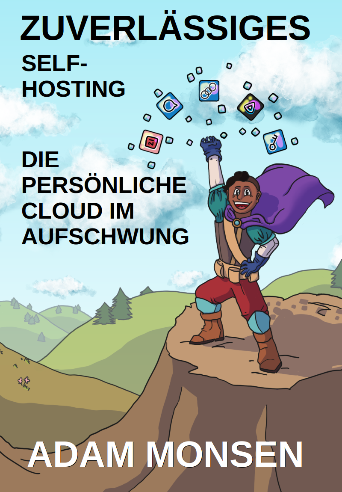

= 📖 Steadfast Self-Hosting
:hide-uri-scheme:

Source code for a most excellent book about self-hosting.

_Steadfast_ primarily targets aspiring self-hosters looking for a quick and reliable method to get started.

Please https://selfhostbook.com/buy/[buy] or <<how_to_build,build>> a <<book_formats,nicely-formatted copy>> of the book for your reading pleasure.
You may also https://selfhostbook.com/buy/#donations[donate] to support my efforts.

Commits here serve as errata corrected since the date and version mentioned in the "`Book version`" section of the "`Introduction`" chapter of the copy you own.

[#how_to_build]
== 🏗️ How to build the book

Run `./book/build.sh` to generate your own typeset outputs.
See `book/Readme.md` for details.

== 🪡 Patches welcome

Your contributions are most welcome!
When submitting a patch, please:

. Heed the link:style-guide.adoc[style guide].
. Sign off every commit (`git commit --signoff`).
Sorry, I know this is annoying, but it is important.
It certifies you wrote or otherwise have the right to submit the patch, following https://developercertificate.org[Developer Certificate of Origin, version 1.1].

== 📜 Warranty

None.

== ⚖️ Copyright and license

The book is (C)2025 Adam Monsen. Some rights reserved. License is https://creativecommons.org/licenses/by-sa/4.0/[Creative Commons Attribution-ShareAlike 4.0 International (CC BY-SA 4.0) License]. This notice also appears in `book/steadfast.asciidoc` and typeset outputs.

mario is (C)2023-2025 Adam Monsen. License is https://www.gnu.org/licenses/agpl-3.0.html[GNU Affero General Public License] as published by the Free Software Foundation, either version 3 of the License, or (at your option) any later version. This notice also appears in `mario/Readme.md` and source code.
